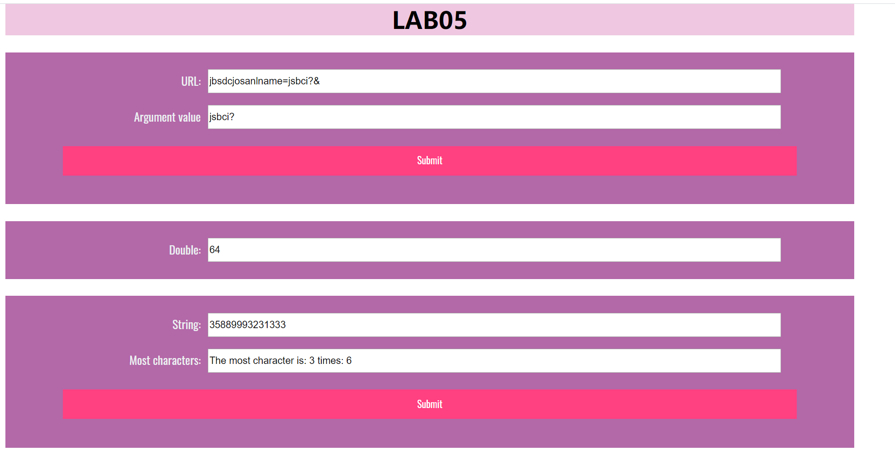
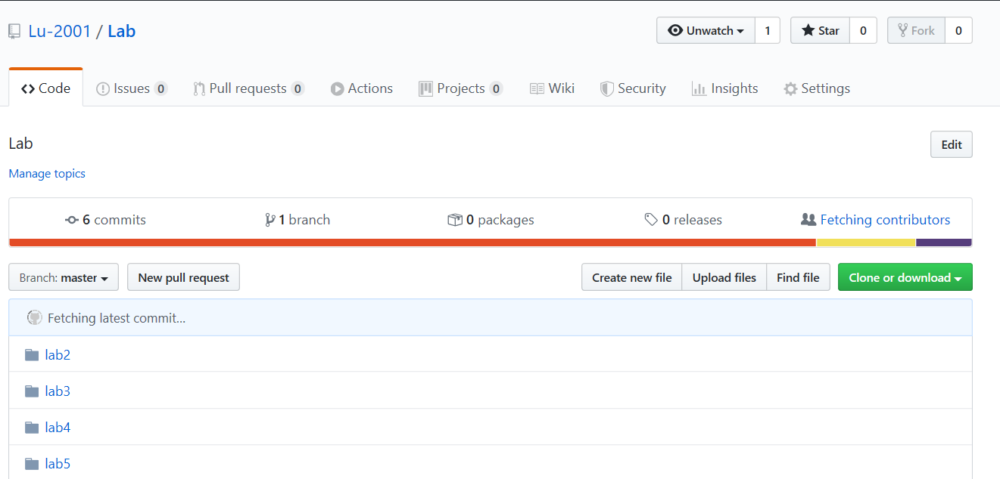

# Lab5设计文档

19302010026 卢政杰

## Question 1

运用indexOf（）方法，获取name，=，&字符（串）的位置，并通过substring（）方法获得子串（需要判断相应字符（串）是否存在）。

## Question 2

运用setInterval（）方法，实现每隔5s运行一次，达到要求后（创建了一个Date对象），通过clearInterval（）方法结束运行。

## Question 3

运用数组存储每个字符出现的次数，取最大的进行输出。运用了字符串的相关属性。

## 截图

