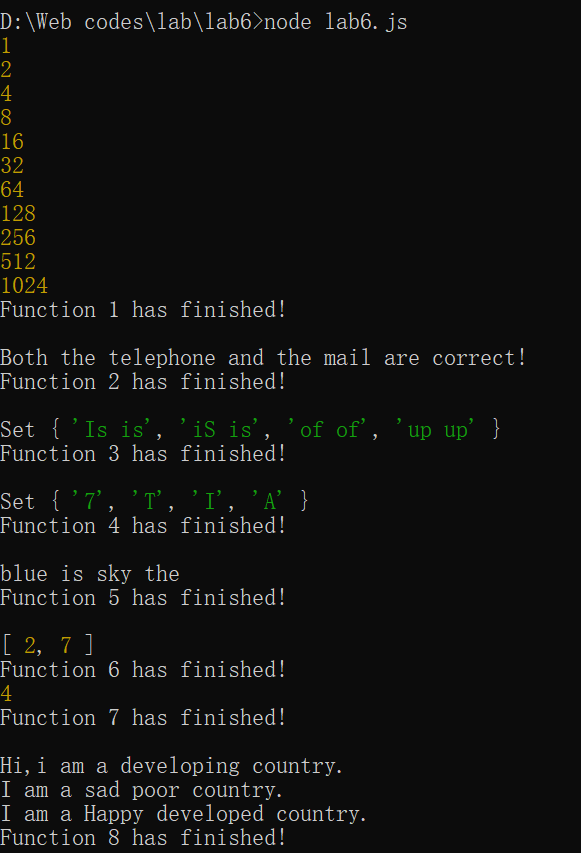

# Lab6设计文档

19302010026 卢政杰

## 1.正则表达式解释
#### function2: 
11位数字；@必须有，@前字符若干，中间可插入“.”、“-”、“_”字符，@后字符若干，至少包含一个“.”
#### function3:
(\b[a-zA-Z]+\b)匹配单词，\s匹配空，+1表示匹配重复单词，gi表示全局不区分大小写。

## 2. 继承不同方式的理解
构造函数继承实质上是在子类构造函数内部调用父类构造函数，不过不能继承父类实例方法；原型链继承是将子类的原型设为父类的实例从而实现继承；Object.create()方法实质上是已有对象的浅复制。

## 3. Map、Set、Array之间的区别和使用
Array不区分是否重复，而Set区分重复，function4利用这一特性，从而找出缺失的字母。function5利用了Array的reverse和split方法。Map类似于对象的键值对有序列表，用于缓存频繁读取的数据。

## 4.截图
